# VidyuthLabs Potentiostat (ESP32-S3 & AD5941)

[](Firmware/)
[](DesktopGUI/)
[](MobileApp/)
[](#license)

A professional-grade, high-precision electrochemical potentiostat platform utilizing the **Analog Devices AD5941** AFE, controlled by an **ESP32-S3** microcontroller. The system supports Cyclic Voltammetry (CV), Chronoamperometry (CA), Square Wave Voltammetry (SWV), and Electrochemical Impedance Spectroscopy (EIS), featuring cross-platform desktop (PyQt6) and mobile (Flutter) interfaces.

---

## 🌟 Key Features

* **Advanced Electrochemical Methods**:
  * **CV / LSV**: Linear and cyclic voltammetric scans.
  * **Chronoamperometry (CA)**: Precision current-vs-time transients.
  * **SWV**: High-sensitivity analytical voltammetry.
  * **EIS**: Multi-frequency complex impedance sweeps up to 200 kHz.
* **Dual Interface Control**:
  * **PyQt6 Desktop Client**: High-performance real-time plotting (via PyQtGraph), CSV exporting, and websocket connectivity.
  * **Flutter Mobile Companion**: BLE-controlled mobile UI with hardware pairing and offline CSV data logging.
* **Safety & Compliance**:
  * Grounded on **IEC 61010-1** electrical safety standards.
  * **IEC 62304** compliant firmware architecture with dual-core watchdogs and hardware state separation.
  * Built-in **CRC32 NVS Integrity Checker** protecting the boot configuration against firmware corruption.

---

## 📁 Repository Structure

```tree
ESP32-Potentiostat/
├── DesktopGUI/                 # PyQt6 Desktop application
│   └── main_gui.py             # Main GUI client entry
├── Firmware/
│   └── ESP32_AD5941_Main/      # ESP32-S3 Arduino sketch
│       ├── AD5941_Driver.cpp   # Core AFE register mapping
│       ├── EIS_Method.cpp      # EIS excitation & DFT engine config
│       ├── Voltammetry_Methods.cpp # CV/SWV/CA scan state machines
│       └── ESP32_AD5941_Main.ino   # Firmware entry point
├── MobileApp/                  # Flutter mobile application
│   └── lib/                    # Dart source code (BLE, Charting)
├── README.md                   # Project documentation
├── walkthrough.md              # Detailed implementation notes
└── codebase_audit_report.md    # API refactoring and SDK compliance report
```

---

## 🛠️ Getting Started

### 1. Firmware Installation

Ensure you have [arduino-cli](https://arduino.github.io/arduino-cli/latest/) or the Arduino IDE installed, with ESP32 board packages v2.x.

#### Compile:
To compile the firmware, you must use the `huge_app` partition scheme to accommodate the SDK, LVGL display drivers, and Bluetooth stacks:
```bash
arduino-cli compile --fqbn esp32:esp32:esp32s3:PartitionScheme=huge_app Firmware/ESP32_AD5941_Main
```

#### Upload:
```bash
arduino-cli upload -p <COM_PORT> --fqbn esp32:esp32:esp32s3:PartitionScheme=huge_app Firmware/ESP32_AD5941_Main
```

### 2. Running the Desktop GUI

The Desktop GUI requires Python 3.10+ and a few python dependencies.

#### Install dependencies:
```bash
pip install PyQt6 pyqtgraph pyserial websocket-client pytest
```

#### Run the GUI:
```bash
python DesktopGUI/main_gui.py
```

### 3. Running the Mobile App

Ensure Flutter is installed and configured.

#### Get packages:
```bash
cd MobileApp
flutter pub get
```

#### Run:
```bash
flutter run
```

---

## 🧪 Testing and Verification

A comprehensive 50-test unit and integration suite has been configured using `pytest` to validate GUI states, parser behavior, serial handlers, parameter limits, and complex impedance calculations.

To run the test suite:
```bash
python -m pytest .gemini/antigravity-ide/brain/222c3492-8d30-4ccc-a6cb-aa6f8fd9d4c9/scratch/test_desktop_gui_full.py -v -p no:nengo
```

---

## ✅ Latest Verified Build

Real, tool-verified results (not claims) from actually compiling the firmware and running the apps — arduino-cli and an Android emulator, not descriptions. What's not here (a hardware bring-up, an LVGL device-screen render) is explicitly called out as not yet done, not silently skipped.

### Firmware — real `arduino-cli` compile

```bash
arduino-cli compile --fqbn esp32:esp32:esp32s3:PartitionScheme=huge_app Firmware/ESP32_AD5941_Main
```

```
Sketch uses 1740497 bytes (55%) of program storage space. Maximum is 3145728 bytes.
Global variables use 132036 bytes (40%) of dynamic memory, leaving 195644 bytes for local variables. Maximum is 327680 bytes.
```
Full log: [`docs/firmware_compile_log.txt`](docs/firmware_compile_log.txt).

**Compiled clean, zero errors, zero warnings**, against the AD5940 SDK, LovyanGFX, lvgl, ArduinoJson, and WebSockets — this is the first real compile since a substantial AFE re-architecture pass (dual-loop LP/HS-loop bring-up, corrected switch-matrix routing, corrected GPIO pin mapping against the actual schematic, a cross-driver SPI-bus mutex). **This confirms the code builds; it does not confirm it's correct on real hardware** — nothing here exercises the actual AD5941 chip, the display panel, or the shared-bus arbitration under real FreeRTOS scheduling. That's the next step, not this one.

### Mobile app — real Android emulator run

Built (`flutter build apk --debug`) and installed on a running AVD (`emulator-5554`, `star_trail_emu`), then driven via `adb shell input` — not a description of the UI, an actual running instance.

| Material profile picker (default view) | Profile dropdown (all 5 bundled profiles) | Advanced / manual mode |
|---|---|---|
| 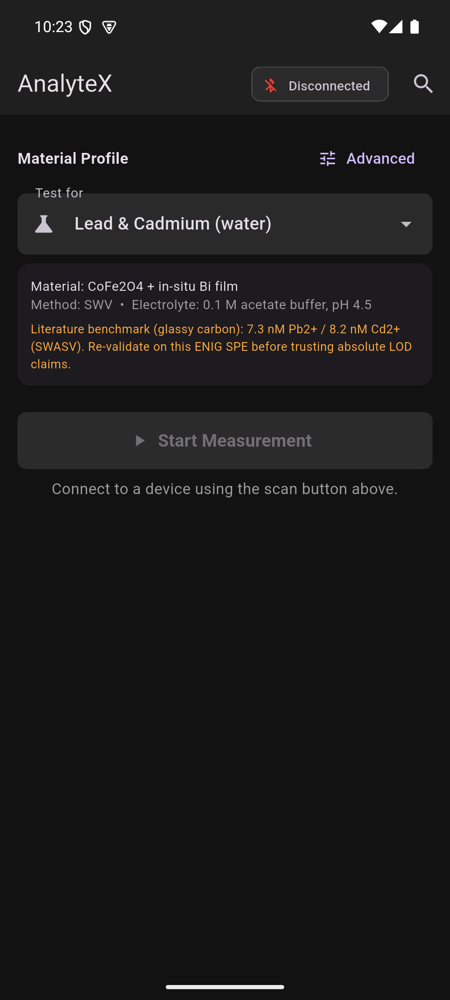 | 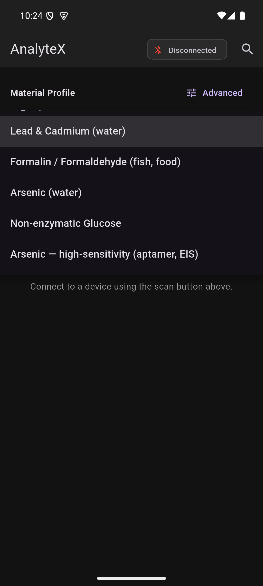 | 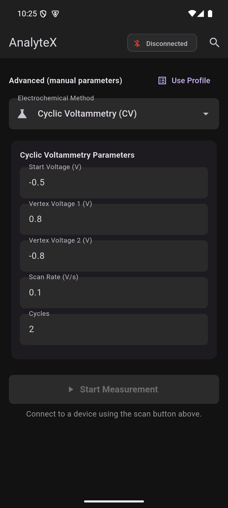 |

**What this confirms:** the app builds and runs on Android; the title bar reads "AnalyteX" (the branding fix took); the material-profile picker built this session actually renders and lets you pick between all 5 bundled profiles (Pb/Cd, formaldehyde, arsenic ×2, glucose); each profile's material/method/electrolyte/notes display correctly; the Advanced-mode toggle correctly falls back to the original manual CV/CA/SWV/EIS parameter forms with their default values intact. **Not tested here:** anything requiring a real device connection (BLE scan/pairing, an actual measurement run, chart rendering with live data) — the emulator has no way to connect to real hardware, so this validates the picker/UI logic only, not the full device-connected flow.

#### Visual design pass (post-screenshot feedback)

The screenshots above were flagged, correctly, as looking bad — flat untouched Flutter-tutorial defaults (`Colors.blueAccent` on `#121212`, no type scale), a connection status buried in a 12px AppBar chip, large dead space below the fold, and a disabled button with no explanation. Fixed in `main.dart` (a real `AnalyteXColors` palette — electric teal on near-black ink, amber reserved for literature/reference callouts — plus a proper `ColorScheme`/`TextTheme`/component themes) and `home_page.dart` (a prominent connect/disconnect banner, a redesigned profile card with a method-badge pill and a highlighted literature-benchmark callout, an inline reason under the disabled Start button instead of a bare grayed-out control, and a "Connect → Pick a test → Measure" footer strip that fills the space instead of leaving it empty):

| Redesigned home screen | Advanced / manual mode (same theme) |
|---|---|
| 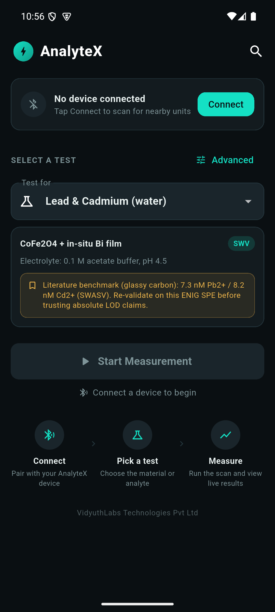 | 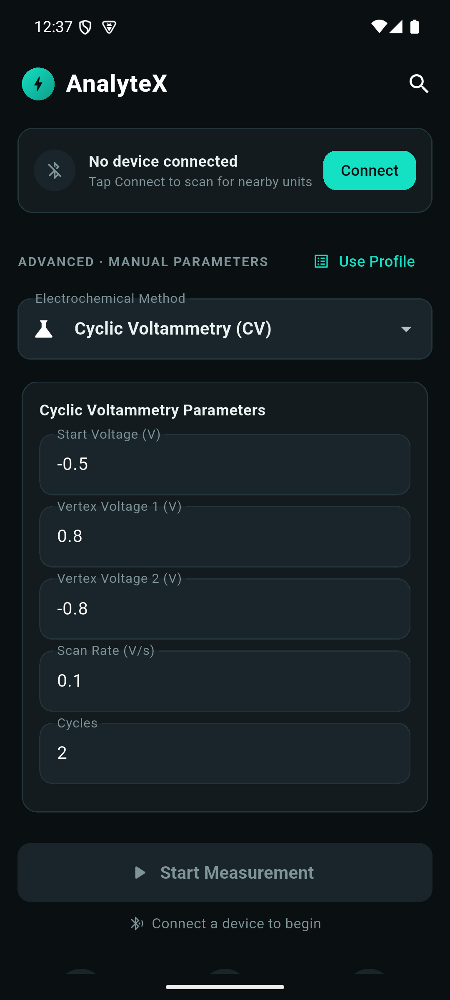 |

Rebuilt (`flutter build apk --debug`, `flutter analyze` clean aside from 2 pre-existing deprecation infos unrelated to this change) and reinstalled on the same AVD to capture both of these — not mockups; the Advanced-mode screenshot was reached by an actual `adb input tap` on the toggle. `chart_page.dart` (the live-plot/results screen) also got matching color-token fixes this pass — the hardcoded `Colors.blueAccent`/`Colors.red[700]`/`Colors.green[700]` status pill, abort button, and error snackbars were replaced with `AnalyteXColors` tokens so it doesn't clash with the rest of the app. **Not screenshotted:** reaching that screen requires an actual BLE-connected device (the Start button is disabled without one), and the Android emulator has no way to pair with real hardware — so this fix is verified by `flutter analyze` passing clean, not by a rendered screenshot.

### Desktop GUI — real PyQt6 run

Launched directly (`python DesktopGUI/main_gui.py`) and screenshotted:

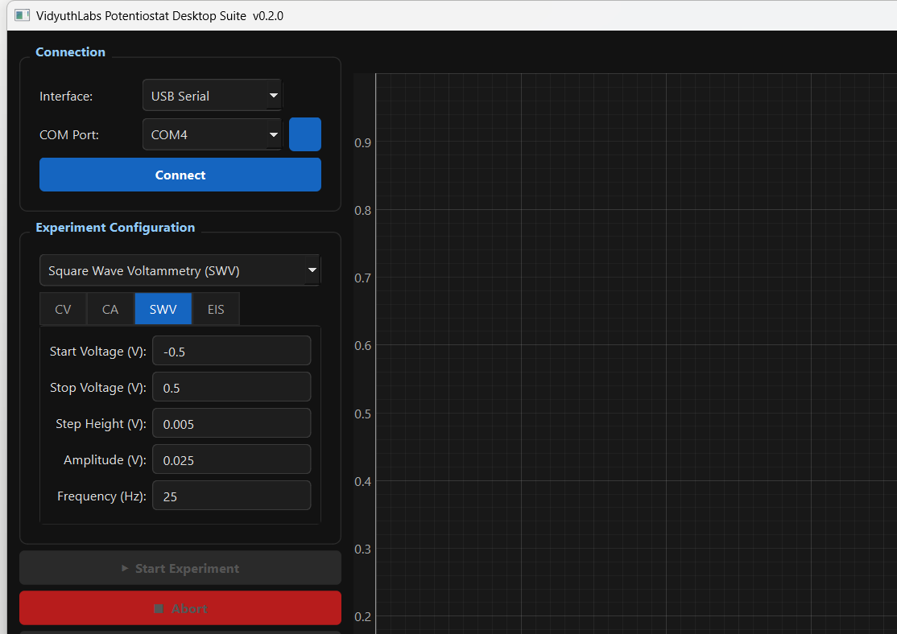

Confirms the app starts, the connection panel and SWV parameter form render correctly with their default values, and the technique tab switching (CV/CA/SWV/EIS) works. Same caveat as above — no real device connected, so this validates UI rendering only.

### LVGL on-device UI — rendered offscreen, real bugs found and fixed

A native MinGW-w64 GCC toolchain (`C:\msys64\mingw64`) turned out to be present on this machine after all. Built a small offscreen simulator that links the **exact vendored `lvgl` 8.3.11 library and `lv_conf.h`** the firmware compiles against (verified: `LV_COLOR_DEPTH=16`, `LV_USE_BTN`/`LABEL`/`CHART=1`, Montserrat 8–48 all enabled) — not a mockup, not a different library version. `Display_LVGL.cpp`'s screen-building calls (`buildMainScreen()`, `showChartScreen()`, `showErrorScreen()`) were copied verbatim into the sim; only LovyanGFX/SPI/FreeRTOS-specific plumbing was stripped, since none of that affects what gets drawn. The flush callback writes straight into a heap framebuffer (no window, no display, no screenshot — nothing to leak) which gets dumped to a BMP.

Rendering the real screen-building code surfaced two actual bugs invisible from reading the source:

| Main screen (before) | Main screen (after fix) |
|---|---|
| 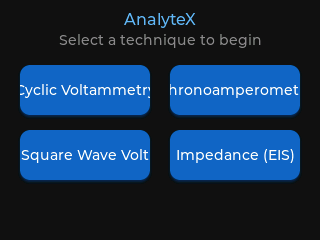 | 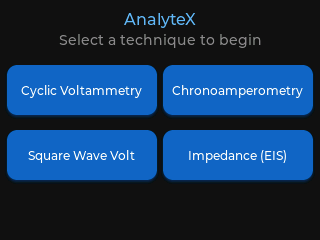 |

"Cyclic Voltammetry" and "Chronoamperometry" were clipped mid-word — the 130×50px buttons were too narrow for those labels at the theme's default font, and LVGL's child-clipping just cut off the overflow. Fixed by widening the buttons to 150px and switching the labels to `montserrat_12` with wrap mode enabled.

| Chart screen (before) | Chart screen (after fix) |
|---|---|
| 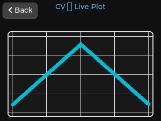 | 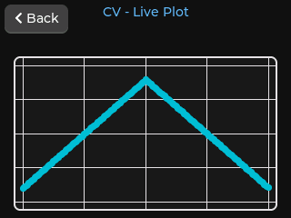 |

The em-dash in `"%s — Live Plot"` rendered as a missing-glyph box — LVGL's built-in Montserrat fonts only cover ASCII + Latin-1 Supplement, not general punctuation like U+2014. Fixed by using a plain hyphen instead.

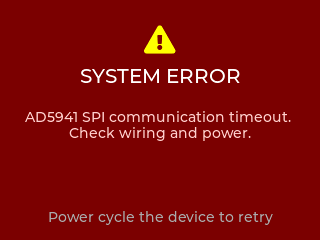

The error screen (icon, wrapped message, instruction) rendered correctly with no changes needed.

**What this confirms:** the actual widget layout, font choices, and text now render correctly for all three screens, using the real library and config the firmware ships with. **What it doesn't confirm:** the LovyanGFX SPI panel driver itself, the XPT2046 touch controller, or the shared-SPI-bus arbitration under real FreeRTOS scheduling — none of that runs in this offscreen sim. Flashing real hardware is still the actual next verification step for those.

---

## 🛡️ Risk & Error Mitigation

* **Flash Memory Protection**: Configured with `huge_app` partition allocating 2 MB of flash for app logic, leaving **38%** memory headroom.
* **Robust Math**: EIS math guards against divide-by-zero errors when dividing real/imaginary values by enforcing a `1e-9` floor threshold on the denominator.
* **Task Safety**: Shared hardware interfaces (such as SPI and NVS storage) are protected using FreeRTOS mutexes to avoid race conditions.

---

## 📄 License

This project is licensed under the MIT License. See [LICENSE](LICENSE) or headers inside source files for third-party component licenses (e.g. AD5940 SDK, LovyanGFX).
